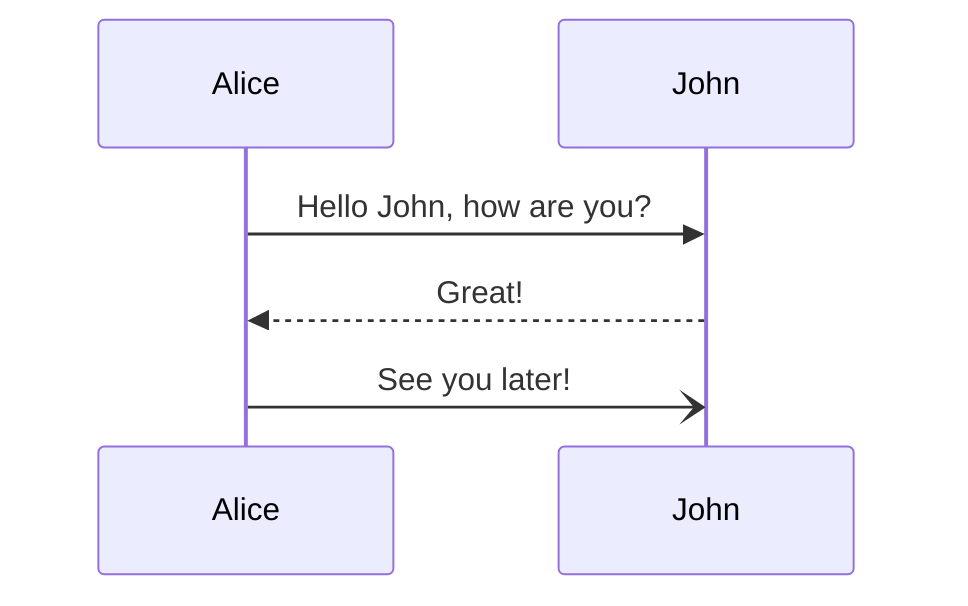

# 源代码模块介绍

- jvm-sandbox-inspector-agent JavaAgent模块
- jvm-sandbox-inspector-data 数据同步模块
- jvm-sandbox-inspector-web 用户操作界面模块
- jvm-sandbox-inspector-debug-consumer 服务调试模块，服务消费者
- jvm-sandbox-inspector-debug-provider 服务调试模块，服务提供者

# 分布式链路

-  [ Dapper, a Large-Scale Distributed Systems Tracing Infrastructure](https://storage.googleapis.com/gweb-research2023-media/pubtools/pdf/36356.pdf  )

