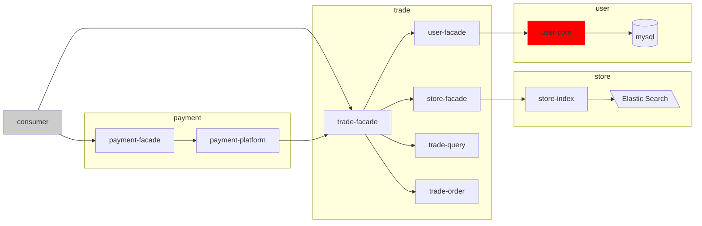
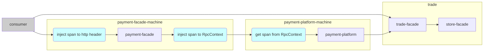

# 1. 简介


简要的用户下单流程

- 1.用户通过Http请求到交易线下单，交易会查询用户的信息以及门店的营业状态，再防重验证后，创建订单。
- 2.用户去拉起支付的支付界面。




## 1.1. 需求

- 微服务架构下,非组内业务不了解，对接时，参数不对，发生异常，都要去找日志，或是arthas watch一下方法的调用
- 常用的测试账号过期了，如何快速`MOCK接口`结果是检查通过
- 发现bug，提交时，需要手工编写入参、出参、异常信息等
- SQL语句错误、分表分库策略失效导致全表扫描等问题主动发现
- ……

[jvm-sandbox-repeater](https://github.com/alibaba/jvm-sandbox-repeater)实现了流量的录制回放，受其启发，编码了`jvm-sandbox-inspector`

# 2. 源代码模块介绍

| module                               | 用途                                                                                                                                             |
|--------------------------------------|------------------------------------------------------------------------------------------------------------------------------------------------|
| jvm-sandbox-inspector-agent          | 使用jvm-sandbox，实现一个JavaAgent模块，具体部署方法见[jvm-sandbox快速开始](https://github.com/alibaba/jvm-sandbox/wiki/USER-QUICK-START) ,实现分布式链路、接口参数录制、接口MOCK等功能 |
| jvm-sandbox-inspector-data           | 数据同步模块（暂未实现），一般用于消费kafka的消息体（消息体中包含接口参数、响应等信息）保存到存储引擎中（ElasticSearch）                                                                          |
| jvm-sandbox-inspector-web            | 用户操作界面模块，查看链路，数据回放，上报配置等                                                                                                                       |
| jvm-sandbox-inspector-debug-consumer | 服务调试模块，服务消费者（rocketmq consumer，dubbo consumer，okhttp）                                                                                          |
| jvm-sandbox-inspector-debug-provider | 服务调试模块，服务提供者（rocketmq sent，dubbo provider，restful 接口）                                                                                          |

# 3. 分布式链路

- 论文地址 [ Dapper, a Large-Scale Distributed Systems Tracing Infrastructure](https://storage.googleapis.com/gweb-research2023-media/pubtools/pdf/36356.pdf  )

在不同的应用中，使用不同的通信协议将span上下文传递。如用户使用http来支付，到了`payment-facade`应用，从header没有
解析出span，就初始化一个新span，作为链路的起始，`payment-facade`通过RPC调用`payment-platform`时，将span就放在
RpcContext中，如果使用rocket mq，可以将span放在user property中。作为通信中的接收方，就解析span是否存在，存在就
继续沿用，不存在就初始化。



# 4. 接口录制

使用jvm-sandbox的事件监听，
- 在`BEFORE`事件时，获取接口的参数
- 在`RETURN`事件时，获取调用的返回结果
- 在`THROWS`事件时，获取异常信息

`com.alibaba.jvm.sandbox.api.listener.EventListener`源码如下：
```java

/**
 * 事件监听器
 *
 * @author luanjia@taobao.com
 */
public interface EventListener {

    /**
     * 触发事件处理
     * <p>
     * 事件处理是整个sandbox最重要的一环,也是整个系统设计的精髓所在
     * </p>
     * <pre>
     * {@code
     * 事件流转流程
     *
     *                                        +-------+
     *                                        |       |
     * +========+  <return>             +========+    | <return immediately>
     * |        |  <return immediately> |        |    |
     * | BEFORE |---------------------->| RETURN |<---+
     * |        |                       |        |
     * +========+                       +========+
     *     |                              |    ^
     *     |         <throws immediately> |    |
     *     |                              |    | <return immediately>
     *     |                              v    |
     *     |                            +========+
     *     |                            |        |
     *     +--------------------------->| THROWS |<---+
     *                    <throws>      |        |    |
     *        <throws immediately>      +========+    | <throws immediately>
     *                                        |       |
     *                                        +-------+
     * }
     * </pre>
     *
     * @param event 触发事件
     * @throws Throwable 处理异常
     */
    void onEvent(Event event) throws Throwable;

}

```

# 5. MOCK

使用jvm-sandbox提供的api，在方法调用前进行结果返回或异常抛出
```java
import static com.alibaba.jvm.sandbox.api.ProcessController.returnImmediately;
import static com.alibaba.jvm.sandbox.api.ProcessController.throwsImmediately;
```

# 6. 阅读

- [代码细节](doc%2Fnotes.md)

- [开发指南](doc%2Fguide.md)